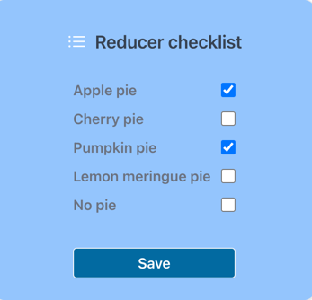

# Reducer Checklist
This is a sample exercise to leverage `useReducer` as a way to hold state for a simple component.
The alternative is `useState` so the objective is to see the differences and how `useReducer` can
simplify logic and testability. We use a simple list of pies which can be checked/unchecked
and saved/unsaved/loading as well as an error/noError state in this simple form. The button should
indicate which state we are in (saved | unsaved | saving).

This project was bootstrapped with [Create React App](https://github.com/facebook/create-react-app).

### Usage
Pull the project down. `Yarn install` and `Yarn start`

## Features
Creates a UI to handle selecting and unselecting items from a list. Rather than store
them in `useState()` we are using `useReducer()` to store the state of the entire app 
as well as the items in the checklist.
* stores the loading state
* stores the error state
* stores the list items

## Intentional Error State
If you try and save a state with zero items it will create an error. This is by design
just to simulate an error state.

## Branches
The main branch uses the standard approach to `useReducer` storing the entire state in the reducer.
The `goal-1` branch stores only the changes in the `state` and lets the component diff the state
with `initialState` to render the display. This makes it easier to differentiate between what is
unsaved changes and saved.

